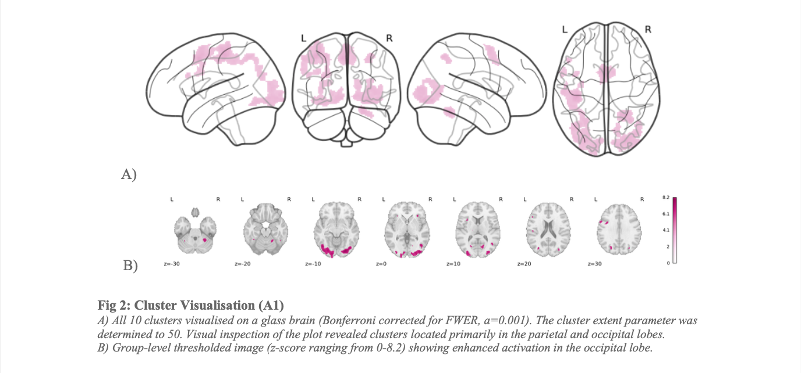

# BSc_project_fMRI - Neuronal Basis of Reading Emotional Words 🧠 💚



The current directory contains all of the code and scripts created and used by [Sirid Wihlborg](https://github.com/siridw) & Emma Olsen to analyse functional magnetic resonance imaging (fMRI) data as a part of our bachelor’s thesis at [Cognitive Science](https://bachelor.au.dk/en/cognitivescience), [Aarhus University](https://cc.au.dk/). 

## Table of content 
0. Project description
1. Project Organization
2. Pipeline
3. Description of results obtained from the analysis
4. A detailed description of the methods used to analyse the data.
5. References to any relevant literature consulted during the analysis
6. Acknowledgments

## 0. Project description
The present fMRI study intends to explore and investigate how affective content in the form of visually presented emotional words might be processed differently than neutral words and potentially lead to altered behaviour and enhanced activation in exstrastriate cortex. 

As the brain data contains personal information about individuals, sharing it on a public repository such as GitHub could be in violation of GDPR and put the individuals at risk. As a result, the original brain data is not shared on the current GitHub repository but stored at a server at the Center of Functionally Integrative Neuroscience (CFIN).

## 1.  Project organization
The project is organised as follows:

```
├── README.md                  <- The top-level README for this project.                        
├── scripts                    <- Main scripts used for analysis and preprocessing. Contact authors to get access to full analysis files.
│   └── git_first_level_fit_function.py                   <- Python script containing function for conducting first level analysis of structural images
│   └── git_fit_master.py.     <- Python script used to run the first level analysis in parallel using the CFIN cluster
│   └── git_second_level.ipynb <- Notebook to replicate second level analysis as well as visualisations
├──  requirement.rtf           <- A requirements file of the required packages.
└──  BSc_project.pdf           <- Bachelor's Thesis
```

Before running the code you must run the following to install requirements:
```
pip install -r requirements.txt
git clone https://github.com/something.git
```

## 2. Pipelines

### 2.0 Create directory with the correct subjects’ data

| Step | Do                                             | File                         | Output placement |
| ---- | ---------------------------------------------- |:---------------------------- |:---------------- |
| 1     | Create a `.csv` file of the subjects to include. The `.csv` file should contain both sub-id and series number. The current study only investigates the control group containing healthy (i.e., non-depressive) subjects identifiable via their XX ID.                                    |     `series_include.csv`                         |                  |
| 2    | Copy and move the correct subject data from the official `raw` folder to the `scratch` folder from which we can work with it                           | `raw_to_scratch`    | `…/data/` |                  |


### 2.1 Converting source data to the brain imaging data structure (BIDS) standard

The following pipeline assumes that your eventfiles/logfiles are BIDS compatible. Be aware that column names and .json files have to be specified correctly. The pipeline furthermore assumes that you have modifyed your study bidsmap (`bidsmap_template.yaml`) file either via BIDScoin’s GUI or by editing the file directly. 

| Step | Do                                                                                                                | File                                                    | Output placement |
| ---- | ----------------------------------------------------------------------------------------------------------------- |:------------------------------------------------------- |:---------------- |
| 0    | Copy and move logfiles (for the subjects to be analysed only) from `aux` drive to `scratch`                       |   `raw_to_scratch`                                                      |                  |
| 1    | Convert logfiles to BIDS compatible format                                                                        | `convert_logfiles_to_BIDS.py`                           |                  |
| 2    | Delete partphase folders                                                                                          | `delete_partphase_folders.py`                                                        |                  |
| 3    | Dele sbref files                                                                                                  | `script_delete_ref_files.py`                                                        |                  |
| 4    | Delete sbref lines in scantsv file                                                                                | `script_delete_sbref_lines_in_scantsv.py`                                                        |                  |
| 5    | Run the bidsmapper and bidscoiner to make bidscoin conversion                                                     | `bidscoiner_emma.py` | `…/data/`                            |                  |
| 7    | Validate your BIDScoin dataset using the online [BIDS Validator](https://bids-standard.github.io/bids-validator/) | [Link](https://bids-standard.github.io/bids-validator/) |                  |

### 2.2 Preprocessing fMRI data using fMRIPrep

The current pipeline runs fMRIPrep via uDocker. 

| Step | Do                                                                                                                                   | File                       | Output placement    |
| ---- | ------------------------------------------------------------------------------------------------------------------------------------ |:-------------------------- |:------------------- |
| 0    | Create `/BIDS/derivatives` folder to output fMRIPrep                                                                                 |                            |                     |
| 1    | Install uDocker, pull fMRIPrep image and create container from the pulled image                                                      | `full_process_udocker.py`  |                     |
| 2    | Verify fMRIPrep image                                                                                                                | `fmriprep_image_verify.py` |                     |
| 3    | Copy and move the correct subject data from the official `raw` folder to the `scratch` folder from which we can work with it         | `raw_to_scratch`           | `scratch/bachelor_scratch/BIDS`          |
| 4    | Define fMRIPrep function in a script that also calls the function (using `argv`).                                                    | `run_fmriprep_all.py`      |                     |
| 5    | Submit the above script (step 4) to the computer cluster to run fMRIPrep and preprocess the fMRI data of all 34 subjects in parallel | `master.py`                | `/BIDS/derivatives` |

### 2.3 Analysing fMRI data 

| Step | Do                                                   | File                               | Output placement |
| ---- | ---------------------------------------------------- |:---------------------------------- |:---------------- |
| 0    | Prepare eventfiles for analysis                      | `looping_over_all_tsv_files.ipynb` |                  |
| 1    | Define first level model                             | `first_level_fit_function.py`      |                  |
| 2    | Fit first level model on all 34 subjects in parallel | `fit_master.py`                    |  `/flms/`                |
| 3    | Run second level model on all 34 sub                 | `second_level.ipynb`                                   |                  |

### 2.4 Analysing behavioral data 

To better understand how the brain activity in the SMA potentially relates to behaviour during the scan, a simple Bayesian GLM was used to conduct an exploratory statistical analysis of the response time measurements. All trials in which no response was given were filtered out. The model was then fitted using the brm() function from the brms package (Bürkner, 2017) imple- mented using R Statistical Software (v4.0.3; R Core Team, 2020) in the RStudio software environment (v.2022.7.2.576; RStudio Team, 2022). The model predicted the response variable, response time, as a linear function of the categorical predictor variable, trial type, with an intercept and a slope coefficient. We used weakly informative priors (student_t, location = 1.6, scale = 2.5) for our model estimates and the model was estimated using MCMC sampling with 4 chains of 2000 iterations and a warmup of 1000. The MCMC algorithm is used to estimate the posterior distribution of the model parameters and the posterior predictive distribution of the response time. To assess quality of the model, prior and pos- terior predictive checks were performed. Additionally, model convergence was validated by visual in- spection of trace plots and ranked Markov chains. R-hat and effective sample size (ESS) were inspected to assess convergence of the Bayesian sampling. R-hat = 1.001 (should be below 1.01 (Vehtari et al., 2021) and ESS = 3631, indicating that the estimation successfully converged. Nonetheless, the model’s explanatory power is very weak (R2 = 3.65e-05, 95% CI [4.95e-11,3.22e-04]) and the posterior mean estimate of the slope did not indicate any credible difference between response time in the two trial types, (β = -0.03 95% CIs -0.03, 0.04). The results of this exploratory analysis did not provide any compelling evidence that the enhanced activity in the SMA observed in the emotional trials could be related to differences in the behavioural measure, response time.

## 3. Description of results obtained from the analysis
First, we conducted a simple analysis (A1) to confirm the hypothesised difference in visual cortex activation when subjects were presented with a word versus a fixation cross (H1). A total of 10 clusters of increased significant activation was found. In line with H1, the majority the clusters were located within the occipital lobe in areas covering parts of the visual system involved in extraction of low-level visual features as well as semantic information. Previous research findings indicate that the extrastriate cortex is involved in visual processing and particularly sensitive to the emotional content of words. Therefore, the second analysis (A2) and the main purpose of this study was to investigate the hypothesis that contrasting emotional and neutral words would show enhanced activity in the extrastriate cortex (H2). Results of A2 provided no support for H2 as no clusters of significant enhanced activation was found in the extrastriate cortex when contrasting emotional nouns to neutral nouns.
 
## 4. A detailed description of the methods used to analyse the data.
First, a reference volume and its skull stripped version was generated using a custom methodology of fMRIPrep. Then, head-motion parameters were estimated and BOLD runs were slice-time corrected to 0.625s (0.5 of slice acquisition range 0s-1.25s). The BOLD time-series were resampled into standard space generating a preprocessed BOLD run in MNI152NLin2009cAsym space and co-registered to a T1w reference using a boundary-based registration cost-function. Confounding time-series were calcu- lated based on the preprocessed BOLD data, including framewise displacement (FD) and DVARS. The confound time series derived from head motion estimates and global signals were expanded with the inclusion of temporal derivatives and quadratic terms. Frames that exceeded a threshold of 0.5 mm FD or 1.5 standardised DVARS were annotated as motion outliers, and additional nuisance time-series were calculated using principal components analysis.


Statistical whole-brain analysis of the fMRI data was based on the mass univariate general linear model (GLM) framework (Friston et al., 1994). We used the two-step GLM procedure (Worsley & Friston, 1995) implemented in Python using Nilearn, a Python package for flexible statistical analysis of neu- roimaging data leveraging the scikit-learn Python toolbox for multivariate statistics (v0.9.2; Abraham et al., 2014). 

The first step in our analysis was to specify a set of regressors, i.e., variables we wish to include in our model to explain our observed data. In addition to regressors modelling the experimental conditions of interest (i.e., the different regressors directly related to the research questions, each of which are time series representing the expected changes in neuronal activity associated with the corresponding condi- tion), we also included nuisance regressors. As previously mentioned, various types of noise are em- bedded in the recorded fMRI data and the measured BOLD signal thus reflects a combination of fluctuations of both neuronal and non-neuronal origin. When dealing with fMRI data, the term nuisance regressors or confounds refers to variables that represent fluctuations with a potential non-neuronal origin (Esteban et al., 2019). These nuisance regressors are confounds to our data that we need to ac- count for in our statistical model to avoid spurious results and minimise the risk of reporting false pos- itives caused by physiological effects rather than neurological causes. Therefore, the removal of nui- sance signals is a crucial step for carrying out statistical analysis of fMRI data.

The current study employs a nuisance regression approach (Lund et al., 2006) based on the large array of confounding variables that are automatically calculated by the fMRIPrep pipeline and stored in sub- ject and run specific tabular files. Inspired by the Yeo 2011 pre-processing schema, the current paper includes the following confounding variables often used in analyses of neuroimaging data: the six stand- ard rigid-body motion parameters (Friston et al., 1998, Lund et al., 2006), csf, and white_matter. The six rigid-body motion parameters, also known as the estimated head-motion parameters, are comprised by three translations (trans_x, trans_y, and tranz_z) and three rotations (rot_x, rot_y, rot_z) estimated relative to a reference image. 

For each subject, two separate first level analyses were conducted, analysis 1 (A1) and analysis 2 (A2), to investigate hypothesis 1 (H1) and hypothesis 2 (H2), respectively. After having specified the linear first level model, we fitted it for each of the 29 subjects using a cosine drift model for the design matri- ces.
The model was fitted to the data in an event-related design with the signal time-locked to the onset of stimuli. The haemodynamic response was modelled using a stick function convolved with the canonical haemodynamic response function (HRF), accounting for the delay in the haemodynamic response. The use of a stick function allowed for the creation of separate HRF-convolved regressors used to model each condition in A1 (word/fixation cross) and A2 (emotional/neutral), respectively.

A high-pass filter with a cut-off frequency of 0.01 Hz was used to remove low-frequency noise related to heart rate, breathing, and slow drifts in the fMRI signal, before being used in a multiple regression
Emma Olsen: 202006507 Sirid Wihlborg: 202007980
18
analysis. We then proceeded to compute contrasts between the regressors of interest for each of the analyses. In the context of fMRI analysis, a contrast is the basic principle of the subtraction method for controlling for potential experimental confounds and refers to the difference in the measured neuronal activity between conditions of interest (Sternberg et al., 2012, ch. 2).

To assess the neuronal activity related to visual processing of a word rather than a fixation cross, A1 contained modelling onsets for the two types of trials (word/fixation cross) and computing within-sub- ject first level contrasts between these (word > fixation cross). To assess the effects of emotional nouns compared to neutral nouns, A2 modelled onsets for the two conditions in trials where nouns were pre- sented (emotional/neutral) and computed within-subject first level contrasts between these (emotional > neutral).

In both cases, contrasts were outputted as a z-score to allow for group-level statistical analysis. The uncorrected contrast images (z-maps) for three subjects are plotted in Fig. 1, with a threshold of p < 0.001 (Bonferroni corrected) in Fig. 1A (A1) and with a p < 0.01 (FDR corrected) in Fig. 1B (A2). Contrast images for all subjects can be found in Appendix 5. Fig. 1 below presents within-subject first level contrasts for three arbitrary subjects and demonstrates the between-subject variability in the first level contrast images before they are analysed at the group level. Visual inspection of the contrast images did not reveal any obvious issues that would necessitate the exclusion of any of the subjects from the study. This suggests that the brain activity was relatively consistent across subjects. Design matrices and contrasts used in A1 and A2 can be found in Appendix 6.

A second level analysis was performed as a part of both A1 and A2. Spatial smoothing was done by applying a Gaussian smoothing kernel with a full-width at half-maximum of 8.0 mm to the data. Ap- plying a Gaussian smoothing kernel implies replacing each data point by a weighted average of itself and its surrounding points, ultimately smoothing the data by reducing the impact of the individual data points and instead emphasising the overall patterns and trends in the data. This is another step taken in reducing the effects of noise and other sources of variability in the data with the aim of increasing the signal-to-noise ratio (Poldrack et al., 2011, ch. 3). The second level model was fitted using the first level model objects as we were interested in an inter- cept-only group-level model, i.e., the average of a particular first-level contrast across subjects for each of our two first level analyses. Using the fitted second-level model, we computed the average group- level contrast using a one-sample t-test.

For each of our analyses, the resulting z-map from our computed contrast (i.e., the performed one-sample t-test), was thresholded in order to perform statistical testing of our second-level analysis. For our first analysis (A1), whole-brain analysis was performed using a voxel-wise significance thresh- old set to p < 0.001 (Bonferroni corrected for multiple comparisons). In A2, whole-brain analysis was performed using a voxel- wise significance threshold set to p < 0.01 (FDR corrected for multiple comparisons).

For each of the analyses (A1 & A2), non-parametric permutation testing was done to assess the statis- tical significance of the results. 

## 5. References to any relevant literature consulted during the analysis
See bibliography in the BSc paper included in the repository

## 6. Acknowledgments
We would like to thank Line Kruse for being a great supervisor providing valuable guidance and feed- back and for allowing us work with data from your project. Thank you to Mikkel Wallentin for guid- ing us through the jungle of fMRI preprocessing. Thank you to Gemma Fernandez and Lau Møller for helping us getting started with parallel cluster computing. Thank you to Lukas Snoek for sharing great resources on fMRI analysis in Python and supporting data sharing in the neuroscientific community.

We hope this repository is useful and that you find the information you need to complete your analysis. Please feel free to explore the repository and contact us if you have any questions. 

/ Sirid Wihlborg (202007980@post.au.dk)
/ Emma Olsen (2020065072@post.au.dk)


