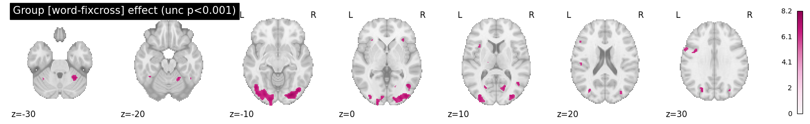

# BSc_project_fMRI - Neuronal Basis of Reading Emotional Words 🧠 💚

The current directory contains code and scripts created by [Sirid Wihlborg](https://github.com/siridw) & Emma Olsen as a part of our bachelor thesis at Cognitive Science, Aarhus University.

**In this repository, you will find:**
1. All of the code and scripts used to analyse the fMRI data. 
2. A detailed description of the methods used to analyse the data. 
3. Instructions on how to run the scripts. 
4. All of the results obtained from the analysis. 
5. References to any relevant literature consulted during the analysis. 

The original brain data is not shared on the current GitHub repository due to GDPR (General Data Protection Regulation) reasons. GDPR is a legal framework that sets guidelines for the collection and processing of personal data from individuals located in the European Union (EU). As the brain data contains personal information about individuals, sharing it on a public repository such as GitHub could be in violation of GDPR and put the individuals at risk. As a result, the original brain data is not shared on the current GitHub repository but stored at a server at the Center of Functionally Integrative Neuroscience (CFIN).

We hope this repository is useful and that you find the information you need to complete your analysis. Please feel free to explore the repository and contact us if you have any questions. 

/ Sirid Wihlborg (202007980@post.au.dk)
/ Emma Olsen (2020065072@post.au.dk)

